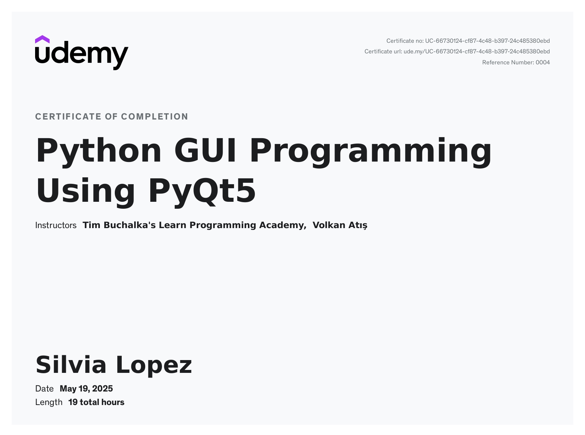

# Python GUI Programming – Volkan Atis (Udemy)

This is the work associated with Volkan Atis’ *Python GUI Programming* course on Udemy.

## Final Thoughts

- Having gone through the entire course, I feel confident in my ability to set up an app and a database using **PyQt** and **SQL**.
- The introductory sections and the first couple of projects are good walkthroughs, but the style that the instructor uses is not elegant or conforming to **PEP8 standards** — which is what I’ve always been pushed to follow.
    - The most annoying thing is that he uses global variables unnecessarily. It’s very frustrating — the work on this repo fixes that.
- The course is about **18 hours** long, which is absolutely preposterous now that I’ve gone through it. The last project is a time sink — there are many modules that are 5–15 minutes long, dedicated to things that could be copy-pasted or turned into helper functions. This results in a section being **7.5 hours** for a project that could absolutely be done in less than half that time (max **3.5 hrs**).

## TL;DR

You gain the most out of the course in the beginning. After a certain point, it’s just way longer than it needs to be. You need to bring into this a healthy knowledge of how to write good Python code — this instructor has some practices that would be bad to copy exactly.

---

Anyways, here’s my certificate.
